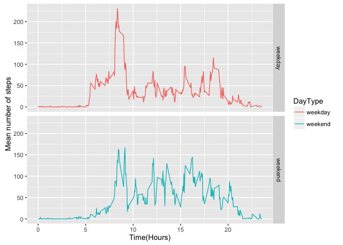

# Analysis of data from a daily activity monitoring device


## Introduction

Activity monitoring devices such as a Fitbit, Nike Fuelband, or Jawbone Up, collect large amounts of data that can be used to aid the wearers' ability to improve their health and understand patters in their own behavior. In this work raw data from such a device is processed in order to apply statistical methods and to gleam physical insights from the data.

## Data Processing and Analysis

The source of the data used in this study is provided by [here](https://d396qusza40orc.cloudfront.net/repdata%2Fdata%2Factivity.zip)


```r
        require(dplyr)
        require(ggplot2)
        require(data.table)
        require(lubridate)
        require(mice)
        activityData <- read.csv("activity.csv", 
                                 header = TRUE, 
                                 na.strings = "NA",
                                 stringsAsFactors = FALSE)

        activityData1 <- data.table(activityData)
        activityData$date <- as.Date(activityData$date, "%Y-%m-%d") 
        dayOfWeek <- weekdays(activityData$date)
        activityData <- cbind(activityData, dayOfWeek)
        activityData <- activityData[which(complete.cases(activityData)),]
```


## Summary of Data Analysis

### The mean total number of steps taken per day


```r
      sumStepsPerDay <- aggregate(activityData$steps, by = list(activityData$date), sum)
        hist(sumStepsPerDay$x, breaks = 50,
                col = "blue", border = NULL,
                main = "Histogram of the total number of steps taken each day",
                xlab = "Total number of steps taken each day")
```


```r
         meanDays <- format(mean(sumStepsPerDay$x, na.rm = TRUE), digits = 2)
```


```r
         medianDays <- format(median(sumStepsPerDay$x, na.rm = TRUE), digits = 2)
```


The distribution of the total number of steps taken per day appear to follow normal behaviour, where the mean of the total number of steps taken per day is 10766 and median number of steps taken each day is 10765.

### The average daily activity pattern

In order to depict the average daily activity pattern, a time series graph of the average steps through the time-span of a day, that is, the mean number of steps for each of the 5 minute time intervals over the 24 hour period, is presented.
Here the summary variable is the number of steps and the grouping variable is the interval.


```r
        activityTimeSeries <- aggregate(activityData$steps, by = list(activityData$interval), mean)
#        activityTimeSeries <- 
        colnames(activityTimeSeries) <- c("Time", "MeanNumberOfSteps")
        activityTimeSeries$Time <- activityTimeSeries$Time/100 # to convert the time interval to hours
        ggplot(activityTimeSeries, aes(x=Time, y=MeanNumberOfSteps)) + geom_line() + xlab("Time(Hours)") + ylab("Mean number of steps")
```


### Time-interval of the maximum number of steps


```r
        maxSteps <- activityTimeSeries[which.max(activityTimeSeries$MeanNumberOfSteps),]
```

The 5-minute interval, on average across all the days in the dataset, which contains the maximum number of steps is at 8.35am.

### Strategy for imputing missing data

Missing data have been replaced by the mean value for that 5-minute interval.

```r
        impute.mean <- function(x) replace(x, is.na(x), mean(x, na.rm = TRUE))

        activityDataNAReplaced <- activityData1 %>%
        group_by(interval) %>%
            mutate(stepsNAReplaced = impute.mean(steps)
                  )
```

### Histogram of the total number of steps taken each day where missing values have been replaced with the mean value for that interval


```r
        sumStepsPerDayMissingReplaced <-    
                aggregate(activityDataNAReplaced$stepsNAReplaced, 
                          by = list(activityDataNAReplaced$date), sum)
        hist(sumStepsPerDayMissingReplaced$x, breaks = 50,
                col = "red", border = NULL,
                main = "Histogram of the total number of steps taken each day",
                xlab = "Total number of steps taken each day")
```


### Comparison of the average number of steps taken per 5-minute interval across weekdays and weekends


```r
        activityDataNAReplaced$date <- as.Date(activityDataNAReplaced$date, "%Y-%m-%d") 
        dayOfWeekNA <- weekdays(activityDataNAReplaced$date)
        activityDataNAReplaced <- cbind(activityDataNAReplaced, dayOfWeekNA)
        
        weekend <- c("Sunday","Saturday")
        weekend <- factor(weekend)
        activityDTWE <- filter(activityDataNAReplaced, dayOfWeekNA %in% weekend)
        activityTimeSeriesWE <- aggregate(activityDTWE$stepsNAReplaced, by = list(activityDTWE$interval), 
                        mean)
        activityTimeSeriesWE <- mutate(activityTimeSeriesWE, DayType = "weekend")
        
        weekday <- c("Monday","Tuesday","Wednesday","Thursday","Friday")
        weekday <- factor(weekday)
        
         
        activityDTWD <- filter(activityDataNAReplaced, dayOfWeekNA %in% weekday)
        
        activityTimeSeriesWD <- aggregate(activityDTWD$stepsNAReplaced, by = list(activityDTWD$interval), 
                        mean)
        
        typeOfDay <- c("weekday", "weekend")
        typeOfDay <- factor(typeOfDay)
        
        activityTimeSeriesWD <- mutate(activityTimeSeriesWD, DayType = "weekday")
        
 
        activityTimeSeriesNA <- rbind(activityTimeSeriesWD, activityTimeSeriesWE)
        
        colnames(activityTimeSeriesNA) <- c("Time", "MeanNumberOfSteps", "DayType")
        
        activityTimeSeriesNA$Time <- activityTimeSeriesNA$Time/100 # to convert the time interval to hours
```

In comparing the average activity behaviour between weekdays and weekends distinctly contrasting behaviour is observed as shown in the panel plot below. Except for the intense activity in the morning interval of approximately $~2$hours, the weekdays, on average, appear to be sedentary whereas on the weekends there is more activity throughout the day.


```r
        ggplot(activityTimeSeriesNA, aes(x = Time, y = MeanNumberOfSteps, color = DayType)) + geom_line() + xlab("Time(Hours)") + ylab("Mean number of steps") + facet_grid(DayType ~ .)
```



