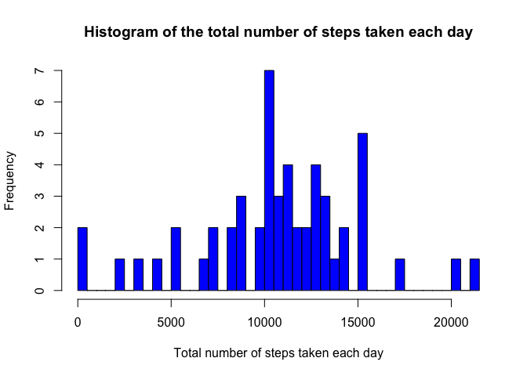
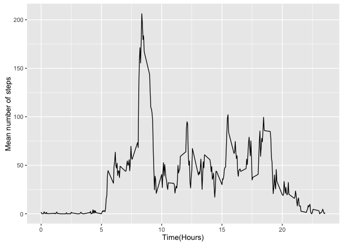
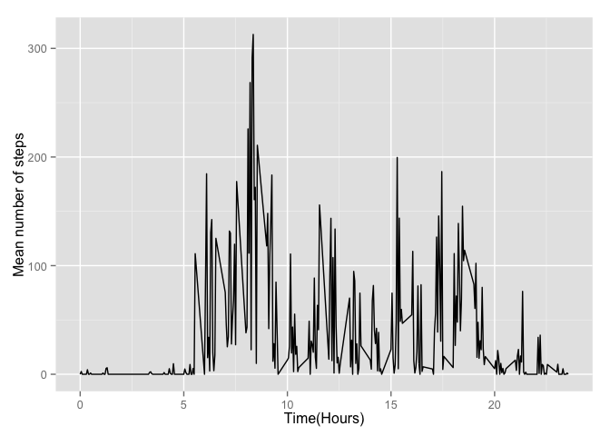

# Reproducible Research: Peer Assessment 1


## Introduction

Activity monitoring devices such as a Fitbit, Nike Fuelband, or Jawbone Up, collect large amounts of data that can be used to aid the wearers ability to improve their health and understand . These type of devices are part of the “quantified self” movement – a group of enthusiasts who take measurements about themselves regularly to improve their health, to find patterns in their behavior, or because they are tech geeks. In this work raw data from such a device is processed in order to apply statistical methods and to gleam physical insights from the data.

## Data Processing and Analysis

The source of the data used in this study is provided by [here](https://d396qusza40orc.cloudfront.net/repdata%2Fdata%2Factivity.zip)


```r
        require(dplyr)
        require(ggplot2)
        require(data.table)
        require(scales)
        require(lubridate)
        activityData <- read.csv("activity.csv", 
                                 header = TRUE, 
                                 na.strings = "NA",
                                 stringsAsFactors=FALSE)

        activityData1 <- data.table(activityData)
        activityData$date <- as.Date(activityData$date, "%Y-%m-%d") 
        dayOfWeek <- weekdays(activityData$date)
        activityData <- cbind(activityData, dayOfWeek)
        activityData <- activityData[which(complete.cases(activityData)),]
```


## Summary of Data Analysis

### The mean total number of steps taken per day


```r
      sumStepsPerDay <- aggregate(activityData$steps, by = list(activityData$date), sum)
        hist(sumStepsPerDay$x, breaks = 50,
                col = "blue", border = NULL,
                main = "Histogram of the total number of steps taken each day",
                xlab = "Total number of steps taken each day")
```

 

The distribution of the total number of steps taken per day appear to follow normal behaviour, where the mean of the total number of steps taken per day is 1.0766189\times 10^{4} and median number of steps taken each day is 1.0765\times 10^{4}.

```r
         mean(sumStepsPerDay$x, na.rm = TRUE)
```


```r
         median(sumStepsPerDay$x, na.rm = TRUE)
```

### The average daily activity pattern
In order to depict the average daily activity pattern, a time series graph of the average steps through the time-span of a day, that is, the mean number of steps for each of the 5 minute time intervals over the 24 hour period, is presented.
Here the summary variable is the number of steps and the grouping variable is the interval.


```r
        activityTimeSeries <- aggregate(activityData$steps, by = list(activityData$interval), 
                        mean)
        colnames(activityTimeSeries) <- c("Time", "MeanNumberOfSteps")
        activityTimeSeries$Time <- activityTimeSeries$Time/100 # to convert the time interval to hours
        ggplot(activityTimeSeries, aes(x=Time, y=MeanNumberOfSteps)) + geom_line() + xlab("Time(Hours)") + ylab("Mean number of steps")
```

 


The 5-minute interval, on average across all the days in the dataset, which contains the maximum number of steps is at `r ` in the morning, as given by

```r
        print(activityTimeSeries[which.max(activityTimeSeries$MeanNumberOfSteps),])
```

```
##     Time MeanNumberOfSteps
## 104 8.35          206.1698
```


### Imputing missing values


```r
        numOfMissing <- sum(is.na(activityData1$steps))
        print(numOfMissing)
```

```
## [1] 2304
```


There are a total of 2304 missing values in the dataset (i.e. the total number of rows with NAs). To handle these missing values in the dataset

The strategy does not need to be sophisticated. For example, you could use the mean/median for that day, or the mean for that 5-minute interval, etc.

Create a new dataset that is equal to the original dataset but with the missing data filled in.

Make a histogram of the total number of steps taken each day and Calculate and report the mean and median total number of steps taken per day. Do these values differ from the estimates from the first part of the assignment? What is the impact of imputing missing data on the estimates of the total daily number of steps?


### The difference in activity patterns between weekdays and weekends

The graph below depicts the difference in the weekday (red plot) and weekend (blue) activity patterns.

```r
        WE <- c("Sunday","Saturday")
        WD <- c("Monday","Tuesday", "Wednesday","Thursday","Friday")

        dayType <- ifelse(activityData$dayOfWeek %in% WD, "weekday", "weekend")
        activityData <- cbind(activityData, dayType)
  
         activityDataWD <- filter(activityData, activityData$dayType == "weekday")
 
         activityDataWE <- filter(activityData, activityData$dayType == "weekend")
 
        activityTimeSeriesWD <- aggregate(activityDataWD$steps, 
                         by = list(activityDataWD$interval), mean)
 
        activityTimeSeriesWE <- aggregate(activityDataWE$steps, 
                        by = list(activityDataWE$interval), mean)

        colnames(activityTimeSeriesWE) <- c("Time", "MeanNumberOfStepsWE")
        activityTimeSeriesWE$Time <- activityTimeSeriesWE$Time/100 

        colnames(activityTimeSeriesWD) <- c("Time", "MeanNumberOfStepsWD")
        activityTimeSeriesWD$Time <- activityTimeSeriesWD$Time/100 # to convert the time interval to hours

        activityTimeSeries <- merge(activityTimeSeriesWD, activityTimeSeriesWE, "Time")
 
        ggplot(activityTimeSeries, aes(x=Time, y=MeanNumberOfStepsWD, color = "Weekdays")) + geom_line() + xlab("Time(Hours)") + ylab("Mean number of steps") +   geom_line(aes(x=Time, y=MeanNumberOfStepsWE, color = "Weekends")) + scale_colour_manual("", breaks = c("Weekdays", "Weekends"), values = c("red", "blue"))
```

 


