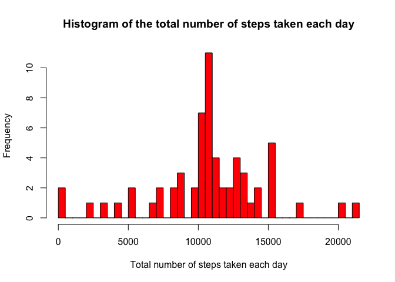

# Reproducible Research: Peer Assessment 1

#

## Abstract

## Introduction

It is now possible to collect a large amount of data about personal movement using activity monitoring devices such as a Fitbit, Nike Fuelband, or Jawbone Up. These type of devices are part of the “quantified self” movement – a group of enthusiasts who take measurements about themselves regularly to improve their health, to find patterns in their behavior, or because they are tech geeks. But these data remain under-utilized both because the raw data are hard to obtain and there is a lack of statistical methods and software for processing and interpreting the data.

## Data Processing and Analysis

The source of the data used in this study is provided by this link 
[https://d396qusza40orc.cloudfront.net/repdata%2Fdata%2Factivity.zip]


```r
        require(dplyr)
```

```
## Loading required package: dplyr
## 
## Attaching package: 'dplyr'
## 
## The following objects are masked from 'package:stats':
## 
##     filter, lag
## 
## The following objects are masked from 'package:base':
## 
##     intersect, setdiff, setequal, union
```

```r
        require(ggplot2)
```

```
## Loading required package: ggplot2
```

```r
        require(data.table)
```

```
## Loading required package: data.table
## 
## Attaching package: 'data.table'
## 
## The following objects are masked from 'package:dplyr':
## 
##     between, last
```

```r
        require(scales)
```

```
## Loading required package: scales
```

```r
        require(lubridate)
```

```
## Loading required package: lubridate
## 
## Attaching package: 'lubridate'
## 
## The following objects are masked from 'package:data.table':
## 
##     hour, mday, month, quarter, wday, week, yday, year
```

```r
        activityData <- read.csv("activity.csv", 
                                 header = TRUE, 
                                 na.strings = "NA",
                                 stringsAsFactors=FALSE)
        activityDT <- data.table(activityData)
        activityDT$date <- as.Date(activityDT$date, "%Y-%m-%d") 
#        activityDT$interval <- minutes(activityDT$interval)
        dayOfWeek <- weekdays(activityDT$date)
        activityDT <- mutate(activityDT, dayOfWeek)
        activityDT <- activityDT[which(complete.cases(activityDT)),]
#        str(activityDT)
```


## Summary of Data Analysis

### The mean total number of steps taken per day


```r
        meanStepsPerDay <- tapply(activityDT$steps, activityDT$date, mean)
        sumStepsPerDay <- tapply(activityDT$steps, activityDT$date, sum)
        hist(sumStepsPerDay, breaks = 50,
          col = "blue", border = NULL,
          main = "Histogram of the total number of steps taken each day",
          xlab = "Total number of steps taken each day")
```

 

The distribution of the total number of steps taken per day appear to follow normal behaviour, where the mean of the total number of steps taken per day is 

```r
         mean(sumStepsPerDay, na.rm = TRUE)
```

```
## [1] 10766.19
```
and median number of steps taken each day is


```r
         median(sumStepsPerDay, na.rm = TRUE)
```

```
## [1] 10765
```

In order to explore the variation of the mean and median of the total number of steps taken per day


```r
        meanPerDay <- aggregate(activityDT$steps, by = list(activityDT$date), 
                       mean)
        colnames(meanPerDay) <- c("date","meanSteps")
        medianPerDay <- aggregate(activityDT$steps, by = list(activityDT$date), 
                       median)
        colnames(medianPerDay) <- c("date","medianSteps")

ggplot(meanPerDay, aes(x=date, y=meanSteps))  + geom_bar(stat="identity", fill="lightblue", colour="lightblue")
```

 


### The average daily activity pattern
In order to depict the average daily activity pattern, a time series graph of the average steps through the time-span of a day, that is, the mean number of steps for each of the 5 minute time intervals over the 24 hour period, is presented.
Here the summary variable is the number of steps and the grouping variable is the interval.


```r
        activityTimeSeries <- aggregate(activityDT$steps, by = list(activityDT$interval), 
                        mean)
        colnames(activityTimeSeries) <- c("Time", "MeanNumberOfSteps")
        activityTimeSeries$Time <- activityTimeSeries$Time/100 # to convert the time interval to hours
        head(activityTimeSeries)
```

```
##   Time MeanNumberOfSteps
## 1 0.00         1.7169811
## 2 0.05         0.3396226
## 3 0.10         0.1320755
## 4 0.15         0.1509434
## 5 0.20         0.0754717
## 6 0.25         2.0943396
```

```r
        tail(activityTimeSeries)
```

```
##      Time MeanNumberOfSteps
## 283 23.30         2.6037736
## 284 23.35         4.6981132
## 285 23.40         3.3018868
## 286 23.45         0.6415094
## 287 23.50         0.2264151
## 288 23.55         1.0754717
```

```r
        ggplot(activityTimeSeries, aes(x=Time, y=MeanNumberOfSteps)) + geom_line() + xlab("Time(Hours)") + ylab("Mean number of steps")
```

 


The 5-minute interval, on average across all the days in the dataset, which contains the maximum number of steps is at 8.35 in the morning, as given by

```r
        print(activityTimeSeries[which.max(activityTimeSeries$MeanNumberOfSteps),])
```

```
##     Time MeanNumberOfSteps
## 104 8.35          206.1698
```


### The difference in activity patterns between weekdays and weekends


```r
        weekend <- c("Sunday","Saturday")
        activityDTWE <- activityDT[which(dayOfWeek == weekend),]
        activityTimeSeriesWE <- aggregate(activityDTWE$steps, by = list(activityDTWE$interval), 
                        mean)
        colnames(activityTimeSeriesWE) <- c("Time", "MeanNumberOfSteps")
        activityTimeSeriesWE$Time <- activityTimeSeriesWE$Time/100 # to convert the time interval to hours

        weekday <- c("Monday","Tuesday", "Wednesday","Thursday","Friday")
        activityDTWD <- activityDT[which(dayOfWeek == weekday),]
```

```
## Warning in dayOfWeek == weekday: longer object length is not a multiple of
## shorter object length
```

```r
        activityTimeSeriesWD <- aggregate(activityDTWD$steps, by = list(activityDTWD$interval), 
                        mean)
        colnames(activityTimeSeriesWD) <- c("Time", "MeanNumberOfStepsWD")
        activityTimeSeriesWD$Time <- activityTimeSeriesWD$Time/100 # to convert the time interval to hours

#        head(activityTimeSeriesWE)
#        tail(activityTimeSeriesWE)
        ggplot(activityTimeSeriesWD, aes(x=Time, y=MeanNumberOfStepsWD)) + geom_line() + xlab("Time(Hours)") + ylab("Mean number of steps") 
```

 

```r
        ggplot(activityTimeSeriesWE, aes(x=Time, y=MeanNumberOfSteps)) + geom_line() + xlab("Time(Hours)") + ylab("Mean number of steps") 
```

 


Calculate and report the total number of missing values in the dataset (i.e. the total number of rows with NAs)

Devise a strategy for filling in all of the missing values in the dataset. The strategy does not need to be sophisticated. For example, you could use the mean/median for that day, or the mean for that 5-minute interval, etc.

Create a new dataset that is equal to the original dataset but with the missing data filled in.

Make a histogram of the total number of steps taken each day and Calculate and report the mean and median total number of steps taken per day. Do these values differ from the estimates from the first part of the assignment? What is the impact of imputing missing data on the estimates of the total daily number of steps?

Are there differences in activity patterns between weekdays and weekends?

For this part the weekdays() function may be of some help here. Use the dataset with the filled-in missing values for this part.

Create a new factor variable in the dataset with two levels – “weekday” and “weekend” indicating whether a given date is a weekday or weekend day.

Make a panel plot containing a time series plot (i.e. type = "l") of the 5-minute interval (x-axis) and the average number of steps taken, averaged across all weekday days or weekend days (y-axis). See the README file in the GitHub repository to see an example of what this plot should look like using simulated data.


